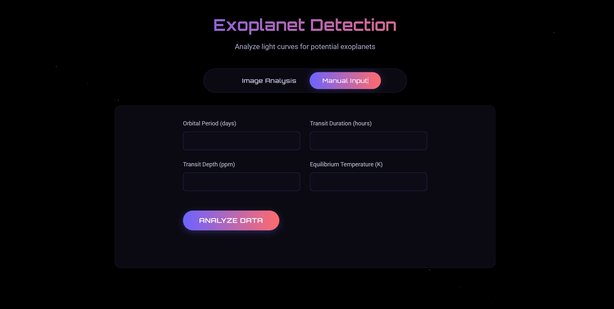

# 🌌 A-World-Away

This project is an AI/ML-powered portal for the automatic detection of exoplanets using NASA's Kepler, K2, and TESS mission data. It showcases data science, astronomy, and user interactivity through a blend of scientific rigor and accessible machine learning.

---

✨ **Unique Features**

- **Automatic Exoplanet Detection**  
  Uses supervised machine learning to classify objects as confirmed exoplanets, candidates, or false positives.
- **Custom Data Preprocessing**  
  Handles missing values, scales features, and selects variables critical for astronomical classification.
- **Web Interface (In Progress)**  
  Allows users to upload or manually enter new candidate data for real-time prediction.
- **Science-Driven**  
  Integrates domain knowledge (light curves, transits, JWST insights) for interpretable results.

---

🚀 **Features**

- NASA exoplanet dataset ingestion and cleaning  
- Feature engineering for key astrophysical parameters (orbital period, transit duration, planetary radius, etc.)
- Missing data handling (median imputation)
- ML model training with evaluation metrics  
- Label encoding and feature scaling  
- Web interface for interactive use  
- Example code and workflow included

---

🛠️ **Technologies Used**

- **Python**: Data handling and ML workflow (mainly via Jupyter Notebook)
- **Flask**: Backend web framework for the interactive portal
- **React**: Frontend framework for dynamic user interface
- **HTML/CSS**: For web UI structure and styling
- **pandas**: For data manipulation and cleaning
- **scikit-learn**: For preprocessing, model training, and evaluation
- **lightkurve**: For light curve analysis and handling astronomical time series data
- **Jupyter Notebook**: For scientific workflow and demonstration

---

📖 **How to Use**

1. **Clone the repository**
    ```
    git clone https://github.com/vivekpatel-1962/A-World-Away.git
    cd A-World-Away
    ```
2. **Download NASA exoplanet datasets** (Kepler, K2, TESS) and place them in the project directory.
3. **Install Python requirements**
    ```
    pip install pandas scikit-learn jupyter flask lightkurve
    ```
4. **Run data analysis and training**
    - Open and run the Jupyter notebook (`Untitled.ipynb`) to preprocess data, train, and test the model.
5. **Run the web backend**
    ```
    python app.py
    ```
    (Make sure Flask is installed and the backend is configured correctly.)
6. **Set up and run the frontend**
    - If the frontend is in a `frontend` folder (with React code):
        ```
        cd frontend
        npm install
        npm start
        ```
    - Open your browser at the address shown in your terminal (usually http://localhost:3000).
7. **Use the web interface to upload or enter new candidate data and visualize predictions.**

---

🔬 **Scientific Background**

- **Transit Method**: Detects exoplanets by observing periodic dips in a star’s brightness as a planet passes in front.
- **JWST Integration**: The James Webb Space Telescope (JWST) observes in infrared, revealing faint, dust-obscured, or distant exoplanets and providing spectra to identify atmospheric gases.
- **Model Features**: Uses astrophysical properties such as orbital period, transit depth, planetary radius, stellar temperature, and false-positive flags to classify candidates.

---

**UI**

*Upload and Analyze Light Curve*


*Manual Feature Entry and Prediction*


🤝 **Contributing**

Want to make this project better?  
Open an issue or submit a pull request with your suggestions or improvements!

---

📚 **References**

- [A World Away: Hunting for Exoplanets with AI]([https://exoplanetarchive.ipac.caltech.edu/](https://www.spaceappschallenge.org/2025/challenges/a-world-away-hunting-for-exoplanets-with-ai/?tab=details))
- Kepler, K2, and TESS mission data
- JWST science documentation

---

**Happy coding and clear skies!** 🚀🔭
